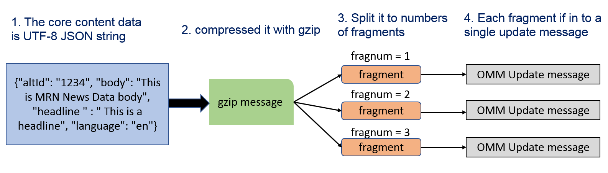

# WebSocket API Machine Readable News Example with Python

- Last update: June 2024
- Environment: Windows and Linux OS
- Compiler: Python
- Prerequisite: The Real-Time Distribution System version 3.2.1 and above, or The Real-Time -- Optimized credentials (V1 and V2), and MRN service

## <a id="overview"></a>Overview

**Important Note**:

- If you are using the Wealth solution (*Pricing Streaming Optimized Service* or *Pricing Streaming Service*), the products currently support Authentication Version 1 only (**As of May 2024**). Please contact your LSEG representative to verify if you are using Wealth or RTO solution.
- For RTO customers, please be informed that the Authentication Version 1 is currently limited support. Please refer to [PCN207737](https://my.refinitiv.com/content/mytr/en/product-notifications/details.html?id=PCN207737) and [PCN208969](https://my.refinitiv.com/content/mytr/en/product-notifications/details.html?id=PCN208969) documents for more detail.

This example shows how developers may use the [Websocket API for Pricing Streaming and Real-Time Service](https://developers.lseg.com/en/api-catalog/refinitiv-real-time-opnsrc/refinitiv-websocket-api) aka Websocket API application to subscribe Machine Readable News (MRN) from LSEG Real-Time Distribution System (RTDS) and LSEG Real-Time Optimized (RTO). The example just connects to LSEG Real-Time platform via a WebSocket connection, then subscribes and displays MRN News data in a console or classic Jupyter Notebook. The project is implemented with Python language for both console and Jupyter Notebook applications, but the main concept for consuming and assembling MRN News messages are the same for all technologies.

Please see the full documentation of this example application in [this article](https://developers.lseg.com/en/article-catalog/article/introduction-machine-readable-news-elektron-websocket-api-refinitiv).

*Note:* The news message is in UTF-8 JSON string format. Some news messages that contain special Unicode character may not be able to show in Windows OS console (cmd, git bash, powershell, etc) due to the OS limitation. Those messages will be print as ```UnicodeEncodeError exception. Cannot decode Unicode character``` message in a console instead.

**Update (As of June 2024)**:

- The RTO console example (Authentication Version 1): Please check my colleague's [LSEG-API-Samples/Example.WebSocketAPI.Python.MRN.RTO](https://github.com/LSEG-API-Samples/Example.WebSocketAPI.Python.MRN.RTO) GitHub Repository.
- The RTO notebook example (Authentication Version 1): *mrn_notebook_app_rto_v1.ipynb* notebook file.
  - Special thanks to Neeranat Junsuriyawong from the Solutions Consultant team for the contribution to this RTO notebook example.
- The RTO console example (Authentication Version 2): *mrn_console_rto_v2.py* file
- The deployed Real-Time Distribution System (RTDS) examples are *mrn_console_rtds.py* console application and *mrn_notebook_app_rtds.ipynb* notebook files.

You can find more information about the Authentication Version 2 from the following resources:

- [Account authorization V1 to V2 migration cheat sheet](https://developers.lseg.com/en/article-catalog/article/account-authorization-v1-to-v2-migration-cheat-sheet) article.
- [Getting Started with Version 2 Authentication for Real-Time - Optimized: Overview](https://developers.lseg.com/en/article-catalog/article/getting-started-with-version-2-authentication-for-refinitiv-real) article.

## <a id="mrn_prerequisite"></a>Prerequisite

This example project supports all LSEG Machine Readable News (MRN) data consumption from the Real-Time platform with the WebSocket API. However, the data model description is focusing on the Real-Time News (MRN_STORY) data processing only. I highly recommend you check the  [WebSocket API Tutorials](https://developers.lseg.com/en/api-catalog/refinitiv-real-time-opnsrc/refinitiv-websocket-api/tutorials) page if you are not familiar with WebSocket API. The Tutorials page provides a step-by-step guide (connect, log in, request data, parse data, etc) for developers who are interested in developing a WebSocket application to consume real-time data from the Real-Time platform.

## <a id="news_mrn_overview"></a>Machine Readable News Overview

Machine Readable News (MRN) is an advanced service for automating the consumption and systematic analysis of news. It delivers deep historical news archives, ultra-low latency structured news and news analytics directly to your applications. This enables algorithms to exploit the power of news to seize opportunities, capitalize on market inefficiencies, and manage event risk.

### <a id="mrn_data_model"></a>MRN Data model

MRN is published over the Real-Time platform using an Open Message Model (OMM) envelope in News Text Analytics domain messages. The Real-time News content set is made available over MRN_STORY RIC. The content data is contained in a FRAGMENT field that has been compressed and potentially fragmented across multiple messages, to reduce bandwidth and message size.

A FRAGMENT field has a different data type based on a connection type:

- RSSL connection (RTSDK [C++](https://developers.lseg.com/en/api-catalog/refinitiv-real-time-opnsrc/rt-sdk-cc)/[Java](https://developers.lseg.com/en/api-catalog/refinitiv-real-time-opnsrc/rt-sdk-java)/[C#](https://developers.lseg.com/en/api-catalog/refinitiv-real-time-opnsrc/rt-sdk-cc)): BUFFER type
- WebSocket connection: Base64 ASCII string

The data goes through the following series of transformations:

1. The core content data is a UTF-8 JSON string
2. This JSON string is compressed using gzip
3. The compressed JSON is split into several fragments (BUFFER or Base64 ASCII string) which each fit into a single update message
4. The data fragments are added to an update message as the FRAGMENT field value in a FieldList envelope



Therefore, to parse the core content data, the application will need to reverse this process. The WebSocket application also needs to convert a received Base64 string in a FRAGMENT field to bytes data before further process this field. This application uses Python [base64](https://docs.python.org/3/library/base64.html) and [zlib](https://docs.python.org/3/library/zlib.html) modules to decode Base64 string and decompress JSON string.

If you are not familiar with MRN concept, please visit the following resources which will give you a full explanation of the MRN data model and implementation logic:

- [Webinar Recording: Introduction to Machine Readable News](https://developers.lseg.com/news#news-accordion-nid-12045)
- [Introduction to Machine Readable News (MRN) with Enterprise Message API (EMA)](https://developers.lseg.com/en/article-catalog/article/introduction-machine-readable-news-mrn-elektron-message-api-ema).
- [MRN Data Models and the Real-Time SDK Implementation Guide](https://developers.lseg.com/en/api-catalog/refinitiv-real-time-opnsrc/rt-sdk-java/documentation#mrn-data-models-implementation-guide).
- [Introduction to Machine Readable News with WebSocket API](https://developers.lseg.com/en/article-catalog/article/introduction-machine-readable-news-elektron-websocket-api-refinitiv).

## <a id="prerequisite"></a>Example Prerequisite

This example requires the following dependencies software and libraries.

1. The Real-Time Advanced Data Hub and Real-Time Advanced Distribution Server version 3.2.x with WebSocket connection and MRN Service.
2. [Python](https://www.python.org/) interpreter and runtime
3. Python [Anaconda](https://www.anaconda.com/distribution/) or [MiniConda](https://docs.conda.io/en/latest/miniconda.html) distribution/package manager.
4. [JupyterLab](https://jupyter.org/) runtime (for the Notebook example only)
5. RTO Access credentials (Version 1 and Version 2) for the RTO example.
6. Internet connection.
7. [Docker Engine - Community Edition](https://docs.docker.com/install/) (for running a console example in Docker only)

*Note:*

- The Python example has been qualified with Python version Python 3.10.x.
- It is not advisable to change the Real-Time Distribution System configuration if you are not familiar with the configuration procedures. Please consult your Market Data administrator for any questions regarding the Real-Time Distribution System-MRN service configuration.
- Please contact your LSEG representative to help you to access the RTO account, and services.
- Please refer to the [pip installation guide page](https://pip.pypa.io/en/stable/installing/) if your environment does not have the [pip tool](https://pypi.org/project/pip/) installed.

## <a id="project_files"></a>Application Files

This example project contains the following files and folders

1. *mrn_console_rtds.py*: The example console application for the deployed RTDS connection file
2. *mrn_console_rto_v2.py*: The example console application for the RTO Authentication Version 2 connection file
3. *.env.example*: The example ```.env``` file for the RTO Authentication Version 2 connection.
4. *notebook_python/mrn_notebook_app.ipynb*: The example Jupyter Notebook application for the deployed RTDS connection file
5. *notebook_python/mrn_notebook_app_rto.ipynb*: The example Jupyter Notebook application for the RTO Authentication Version 1 connection file
6. *notebook_python/.env.example*: The example ```.env``` file for the RTO Authentication Version 1 connection notebook.
7. *Dockerfile*: The example application Dockerfile
8. *requirements.txt*: The application dependencies configuration file
9. LICENSE.md: Project's license file
10. README.md: Project's README file
11. .gitignore and .dockerignore: Docker and Git ignore files.

## <a id="how_to_run"></a>How to run this example

The first step is to unzip or download the example project folder into a directory of your choice, then choose how to run the application based on your environment below.

### <a id="how_to_setup_console"></a>Set Up A Console Environment

It is an advisable to create a dedicate Python environment to run each Python project. You can create a new Conda environment names *MRN_RTO* with the following steps

1. Open Anaconda Prompt and go to the project's folder
2. Run the following command in an Anaconda Prompt to create a Conda environment named *MRN_RTO* for the project.

  ```bash
  (base) $>conda create --name MRN_RTO python=3.10
  ```

3. Once the environment is created, activate MRN_RTO environment with this command in Anaconda Prompt

  ```bash
  (base) $>conda activate MRN_RTO
  ```

4. Run the following command to install the dependencies in the *MRN_RTO* environment

  ```bash
  (MRN_RTO) $>pip install -r requirements.txt
  ```

### <a id="how_to_setup"></a>Set Up A Jupyter Notebook Environment

It is an advisable to create a dedicate Python environment to run each Python project. You can create a new Conda environment names *MRN_RTO* with the following steps

1. Open Anaconda Prompt and go to the project's folder
2. Run the following command in an Anaconda Prompt to create a Conda environment named *MRN_Notebook* for the project.

  ```bash
  (base) $>conda create --name MRN_Notebook python=3.10
  ```

3. Once the environment is created, activate MRN_Notebook environment with this command in Anaconda Prompt

  ```bash
  (base) $>conda activate MRN_Notebook
  ```

4. Run the following command to install the dependencies in the *MRN_Notebook* environment

  ```bash
  (MRN_Notebook) $>pip install -r requirements_notebook.txt
  ```

### <a id="rtds_jupyter"></a>RTDS Jupyter Notebook example

Please be informed that your Real-Time Advanced Data Hub and Real-Time Advanced Distribution Server should have a Service that contains MRN data. The Python [Anaconda](https://www.anaconda.com/distribution/) or [MiniConda](https://docs.conda.io/en/latest/miniconda.html) distribution/package manager is highly recommended for running the JupyterLab example.

1. Open Anaconda Prompt and go to the project's folder
2. Activate MRN_RTO environment with this command in Anaconda Prompt

  ```bash
  (base) $>conda activate MRN_Notebook
  ```

3. In the current Anaconda Prompt, go to the project's notebook folder. Run the following command to start the JupyterLab application in the notebook folder.

  ```bash
  (MRN_Notebook) $>jupyter lab
  ```

4. Open *mrn_notebook_app_rtds.ipynb* Notebook document, then follow through each notebook cell.

### <a id="rtds_console"></a>RTDS Console example

Please be informed that your Real-Time Advanced Data Hub and Real-Time Advanced Distribution Server should have a Service that contains MRN data.

1. Open Anaconda Prompt and go to the project's folder
2. Activate MRN_RTO environment with this command in Anaconda Prompt

  ```bash
  (base) $>conda activate MRN_RTO
  ```

3. Then you can run mrn_console_rtds.py application with the following command

  ```bash
  (MRN_RTO) $> python mrn_console_rtds.py --hostname <Real-Time Advanced Distribution Server IP Address/Hostname> --port <WebSocket Port> 
  ```

4. The application subscribes to ```MRN_STORNY``` RIC code from Real-Time Advanced Distribution Server by default. You can pass your interested MRN RIC code to ```--ric``` parameter on the application command line. The supported MRN RIC codes are ```MRN_STORY```, ```MRN_TRNA```, ```MRN_TRNA_DOC``` and ```MRN_TRSI``` only.

### <a id="rto_jupyter"></a>RTO Authentication Version 1  Jupyter Notebook example

Please be informed that your RTO access credentials should have a permission to request MRN data.

1. Open Anaconda Prompt and go to the project's folder
2. Activate MRN_Notebook environment with this command in Anaconda Prompt

  ```bash
  (base) $>conda activate MRN_Notebook
  ```

3. Go to the project's notebook folder. and create a file name ```.env``` with the following content.

  ```ini
  # RTO Authentication Version 1 Credentials
  RTO_USERNAME=<Your RTO Machine-ID>
  RTO_PASSWORD=<Your RTO Password>
  RTO_CLIENTID=<Your RTO App Key>

  # RDP-RTO Core Configurations
  RDP_BASE_URL=https://api.refinitiv.com
  RDP_AUTH_URL=/auth/oauth2/v1/token
  RDP_DISCOVERY_URL=/streaming/pricing/v1/
  ```

4. In the current Anaconda Prompt notebook folder. Run the following command to start the JupyterLab application in the notebook folder.

  ```bash
  (MRN_Notebook) $>jupyter lab
  ```

5. Open *mrn_notebook_app_rto_v1.ipynb* Notebook document, then follow through each notebook cell.

### <a id="rto_console"></a>RTO Authentication Version 1 Console Example

Please check my colleague's [LSEG-API-Samples/Example.WebSocketAPI.Python.MRN.RTO](https://github.com/LSEG-API-Samples/Example.WebSocketAPI.Python.MRN.RTO) GitHub Repository.

Alternatively, the *mrn_trna_console_rto.py* example of the [LSEG-API-Samples/Example.WebSocketAPI.Python.TRNA](https://github.com/LSEG-API-Samples/Example.WebSocketAPI.Python.MRN.TRNA) project also supports the MRN consumer with RTO (Authentication Version 1), but it subscribes to ```MRN_TRNA``` RIC code from the RTO by default.

### <a id="rtds_console_docker"></a>Bonus: RTO Authentication Version 2 console Docker example

1. Create a file name ```.env``` at the root folder of the project and then add the following content to a file

    ```ini
    ## Authentication Version 2
    CLIENT_ID=CLIENT_ID_V2
    CLIENT_SECRET=CLIENT_SECRET_V2
    ```

2. Open a ```Dockerfile``` and remove the following lines from a file

    ```dockerfile
    # ------------ Begin: For run in internal LSEG ZScaler environment ------------
    #Image runs internet requests over HTTPS – Install Certs if dev environment

    #Add the CA Certificate to the container
    ADD ./ZscalerRootCerttificate.pem /usr/local/share/ca-certificates/ZscalerRootCertificate-2048-SHA256.crt
    RUN chmod 644 /usr/local/share/ca-certificates/ZscalerRootCertificate-2048-SHA256.crt && update-ca-certificates
    ENV REQUESTS_CA_BUNDLE=/etc/ssl/certs/ca-certificates.crt

    # ------------ End: For run in internal LSEG ZScaler environment ------------
    ```

2. Go to the project folder in the console
3. Run the following command in a console to build an image from a Dockerfile.

    ```bash
    $> docker build -t rto_v2_ws_mrn_python .
    ```

4. Once the build is a success, you can create and run the container with the following command

    ```bash
    $> docker run --name rto_v2_ws_mrn_python -it rto_v2_ws_mrn_python --ric <MRN RIC name>
    ```

5. Press Ctrl+C buttons to stop the application

## Example Results

### Send MRN_STORY request to Real-Time Advanced Distribution Server

```bash
SENT:
{
  "Domain":"NewsTextAnalytics",
  "ID":2,
  "Key":{
    "Name":"MRN_STORY"
  }
}
RECEIVED: 
[
  {
    "Domain":"NewsTextAnalytics",
    "Fields":{
      "ACTIV_DATE":"2019-07-20",
      "CONTEXT_ID":3752,
      "DDS_DSO_ID":4232,
      "FRAGMENT":null,
      "FRAG_NUM":1,
      "GUID":null,
      "MRN_SRC":"HK1_PRD_A",
      "MRN_TYPE":"STORY",
      "MRN_V_MAJ":"2",
      "MRN_V_MIN":"10",
      "PROD_PERM":10001,
      "RDN_EXCHD2":"MRN",
      "RECORDTYPE":30,
      "SPS_SP_RIC":".[SPSML2L1",
      "TIMACT_MS":37708132,
      "TOT_SIZE":0
    },
    "ID":2,
    "Key":{
      "Name":"MRN_STORY",
      "Service":"ELEKTRON_DD"
    },
    "PermData":"AwhCEAAc",
    "Qos":{
      "Rate":"TickByTick",
      "Timeliness":"Realtime"
    },
    "SeqNumber":32240,
    "State":{
      "Data":"Ok",
      "Stream":"Open",
      "Text":"All is well"
    },
    "Type":"Refresh"
  }
]
```

### Receive Update message and assemble News

```bash
RECEIVED: 
[
  {
    "DoNotCache":true,
    "DoNotConflate":true,
    "DoNotRipple":true,
    "Domain":"NewsTextAnalytics",
    "Fields":{
      "ACTIV_DATE":"2019-07-25",
      "FRAGMENT":"H4sIAAAAAAAC/71UW2/bNhR+36840MNe5sq2HCcx0W5QbTfW4miO5bRp2mCgRcpmLZEaSVnJhv33HUpyUKAvfSgGCfwOb+c7PLd/PJrbiHnEkxGrx+xyUTOv59GKCS5TbjzyyYtXZBqvQ1xGKZrdx95jz9sq9oy3lrRUmkpYUC0QqKUGYpFTAeHBiiOFt1wbsQeGm9eqKJURRsBKaasylQsF8Fl+liFjwgolaY4aLE33BZfWQIqXthwyVUmGQq5q4k7vrS1Jv1+yzNe8skjgp6pwc8lrc0KfmvI38eZsNBhP0tE2G/DRxfhs+HP1ptKSuBNFTr66T4LBcDK4CMbEeeLc3mbLD47t/2KcTB4Wye7E6L6ZqrY5hzQX6QGUBLvncLdeAt2qIwer4Ch43axSbUWac3+Vc2o4SGVxf08tCIlkklugKQbTgDCg+V+V0Jz5EGXwrCrgTyXXTbSh1AoZi+60kLtG+0lJD8pWf6qkqXLrbmvAjVrpA1BWCCmM1dQqDfhbnu6lSDGmpioxS6x705JabiwcXVbgk1QGIVMY4zBFajRYc8q4bu1EF2EeMM5e3rqavYNM5Nz4ABu0LP9Gm7O309Flj9paKiQqybQqoItkXdc+dcRtHLViVWpNn7ZW9J0GY3kZ+Htb5M7ud/igNXd8DGKMZA+66ExP0VGSdwY0HmLckE+uWB7BAY5hEoXNBAdXTwjJxm3MbzcfEZbNzv0qufJ/v36Er1j5kUoLKy0wRJHMlC6oq5bvsIG87vT9Cli+mdDGTvFx+AqsXZd+rwYXr4LxZjggowkZXfrn5+cPeHKPDsjRaz+kwlGfcHwvDebPNu2DKLhYTy7vlju1+uW5vzCjjTpmwTWbpA+35vj28JT9fThzt6Wx1HWjPzLsR9h8cip3Fd0584RrVwVmK043zyUuBTgXRTfxLH+y/RLNlXgOA30UmBu4Hieulbm1aptYaitsdR7SWFIZik7FHVNtv3BMC9cDQzLElatuDMYtzK8bnEYNtJMExxsyvJ01OApaWDQQvm8gvmvAOXpNugC57hqQMJmH8UmMwpN0vwqnrTy9WcUfW3F+s77qJEygVopmLS5Pws0Ga6YV4/mHdSut591FZHthwVx0fd3SA0+wRbh+4JFhz6v0DmXs9aOe1xXad6TQvz/9B7krulxaBgAA",
      "FRAG_NUM":1,
      "GUID":"Idw5d8Hwd_1907252I27R98ULgoP+y/Hs3Tovf2Kd9cZQsvBkxfzk4",
      "MRN_SRC":"HK1_PRD_A",
      "MRN_TYPE":"STORY",
      "MRN_V_MAJ":"2",
      "MRN_V_MIN":"10",
      "TIMACT_MS":38378746,
      "TOT_SIZE":882
    },
    "ID":2,
    "Key":{
      "Name":"MRN_STORY",
      "Service":"ELEKTRON_DD"
    },
    "PermData":"AwhCEBkrEiFLEkMM",
    "SeqNumber":32350,
    "Type":"Update",
    "UpdateType":"Unspecified"
  }
]
FRAGMENT length = 882
decompress News FRAGMENT(s) for GUID  Idw5d8Hwd_1907252I27R98ULgoP+y/Hs3Tovf2Kd9cZQsvBkxfzk4
News = {'altId': 'nIdw5d8Hwd', 'audiences': ['NP:CNRA', 'NP:IDXN'], 'body': 'Laporan Harian atas Nilai Aktiva Bersih dan Komposisi Portofolio  \n\nAdditional attachments can be found below:\n\nhttp://pdf.reuters.com/pdfnews/pdfnews.asp?i=43059c3bf0e37541&u=urn:newsml:reuters.com:20190725:nIdw6tQfLW\n\n\n\nhttp://pdf.reuters.com/pdfnews/pdfnews.asp?i=43059c3bf0e37541&u=urn:newsml:reuters.com:20190725:nIdw99ZHSg\n\n\n\n\n\nDouble click on the URL above to view the article.Please note that internet access is required. If you experience problem accessing the internet, please consult your network administrator or technical support\n\nLatest version of Adobe Acrobat reader is recommended to view PDF files.  The latest version of the reader can be obtained from http://www.adobe.com/products/acrobat/readstep2.html\n\nFor Related News, Double Click on one of these codes:[IDXN] [IDX] [ASIA] [ID] [CNRA] [STX] [EQTY] [LID] [XPSG.JK] \n\nFor Relevant Price Information, Double Click on one of these code:<XPSG.JK> ', 'firstCreated': '2019-07-25T10:39:38.666Z', 'headline': 'Laporan Harian atas Nilai Aktiva Bersih dan Komposisi Portofolio  ', 'id': 'Idw5d8Hwd_1907252I27R98ULgoP+y/Hs3Tovf2Kd9cZQsvBkxfzk4', 'instancesOf': [], 'language': 'id', 'messageType': 2, 'mimeType': 'text/plain', 'provider': 'NS:IDX', 'pubStatus': 'stat:usable', 'subjects': ['A:1', 'G:1', 'G:25', 'G:2EK', 'G:CI', 'G:K', 'G:S', 'M:1QD', 'M:32', 'M:3H', 'M:AV', 'M:NU', 'M:Z', 'R:XPSG.JK', 'N2:ASEAN', 'N2:ASIA', 'N2:ASXPAC', 'N2:CMPNY', 'N2:EMRG', 'N2:EQTY', 'N2:ID', 'N2:LID', 'N2:MTPDF', 'N2:NEWR', 'N2:REG', 'N2:SEASIA', 'N2:STX'], 'takeSequence': 1, 'urgency': 3, 'versionCreated': '2019-07-25T10:39:38.666Z'}
```

## <a id="contributions"></a>Contributors

- Wasin Waeosri (<wasin.waeosri@lseg.com>)
- Neeranat Junsuriyawong (<neeranat.junsuriyawong@lseg.com>)

## <a id="references"></a>References

For further details, please check out the following resources:

- [Real-Time Market Data APIs & Distribution page](https://developers.lseg.com/en/use-cases-catalog/refinitiv-real-time) on the [LSEG Developer Community](https://developers.lseg.com/) website.
- [WebSocket API page](https://developers.lseg.com/en/api-catalog/refinitiv-real-time-opnsrc/refinitiv-websocket-api).
- [Developer Webinar Recording: Introduction to Electron WebSocket API](https://www.youtube.com/watch?v=CDKWMsIQfaw).
- [Introduction to Machine Readable News with WebSocket API](https://developers.lseg.com/en/article-catalog/article/introduction-machine-readable-news-elektron-websocket-api-refinitiv).
- [Machine Readable News (MRN) & N2_UBMS Comparison and Migration Guide](https://developers.lseg.com/en/article-catalog/article/machine-readable-news-mrn-n2_ubms-comparison-and-migration-guide).
- [Introduction to Machine Readable News (MRN) with Enterprise Message API (EMA)](https://developers.lseg.com/en/article-catalog/article/introduction-machine-readable-news-mrn-elektron-message-api-ema).
- [MRN Data Models and Real-Time SDK Implementation Guide](https://developers.lseg.com/en/api-catalog/refinitiv-real-time-opnsrc/rt-sdk-java/documentation#mrn-data-models-implementation-guide).
- [MRN WebSocket JavaScript example on GitHub](https://github.com/LSEG-API-Samples/Example.WebSocketAPI.Javascript.NewsMonitor).
- [MRN WebSocket C# NewsViewer example on GitHub](https://github.com/LSEG-API-Samples/Example.WebSocketAPI.CSharp.MRNWebSocketViewer).
- [Developer Article: Introduction to Machine Readable News with WebSocket API](https://developers.lseg.com/en/article-catalog/article/introduction-machine-readable-news-elektron-websocket-api-refinitiv).
- [LSEG-API-Samples/Example.WebSocketAPI.Python.MRN.RTO](https://github.com/LSEG-API-Samples/Example.WebSocketAPI.Python.MRN.RTO) GitHub Repository.
- [Account authorization V1 to V2 migration cheat sheet](https://developers.lseg.com/en/article-catalog/article/account-authorization-v1-to-v2-migration-cheat-sheet) article.
- [Getting Started with Version 2 Authentication for Real-Time - Optimized: Overview](https://developers.lseg.com/en/article-catalog/article/getting-started-with-version-2-authentication-for-refinitiv-real) article.
- [Real-Time WebSocket API: The Real-Time Optimized Version 2 Authentication Migration Guide](https://developers.lseg.com/en/article-catalog/article/webSocket-api-rto-v2-authentication-migration-guide) article.

For any questions related to this example or WebSocket API, please use the Developer Community [Q&A Forum](https://community.developers.refinitiv.com/spaces/152/websocket-api.html).
